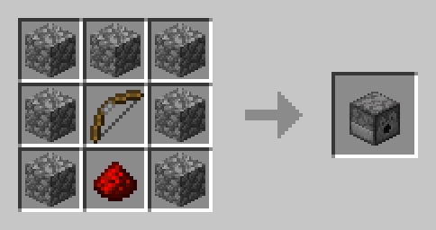
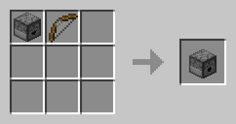
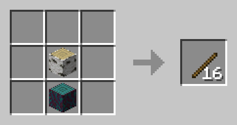
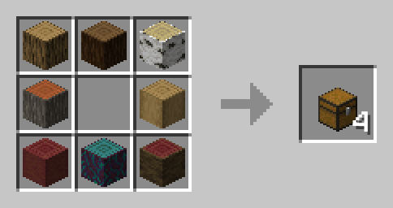

# Enhanced Crafting Vanilla

A small data pack that adds crafting recipes for vanilla items to make every day life a bit easier.

This data pack adds crafting and smelting recipes that should be in the game by default. It does this in a way that makes sense, is balanced and maintains the overall amount of items and experience received per resource.

## Crafting recipes

The following recipes are altered or added for the crafting table

### Dropper cobbled deepslate and blackstone support

Cobbled deepslate and blackstone are very similar to cobblestone. They should be interchangeable and be used in more crafting recipes. This recipe makes it possible to craft droppers using cobbled deepslate and blackstone.

### Dispenser cobbled deepslate and blackstone support

Just like with the droppers, cobbled deepslate and blackstone are normally not accepted as part of the crafting recipe. This changes that.

### Dropper to dispenser conversion

The crafting recipe for a dispenser is just the same as that of a dropper with an extra bow added to it. This recipe allows you to add the bow afterwards.

### Logs to sticks

Sometimes you just need a lot of sticks, and the extra step of converting your logs to 4 planks seems unnecessary. This recipe allows you to skip that step and convert your 2 logs straight into 16 sticks. Any log type is supported, even stripped logs.

### Logs to chests

When building a storage system, crafting hoppers or making a lot of shulkerboxes, you need a lot of chests. It can be very annoying to craft them as the planks take twice the amount of space in your inventory, and leave you with less room to actually craft the chests. This recipe changes that. By putting any log type in a chest like patern in the crafting table, you can create 4 chests without having to craft planks.

## Smelting recipes

The following recipes are altered or added for the furnace, smoker and/or blast furnace.

### Raw ore blocks to smelted blocks

For some reason, it's not possible to smelt raw ore blocks without decompressing them first. This recipe makes it possible to smelt raw iron blocks, raw gold blocks and raw copper blocks to their smelted variants. This can be done in a furnace or in a blast furnace and gives the same amount of xp as it would take to smelt the 9 raw ores manually. Note: this does take less fuel and is quicker then smelting the raw ores one by one.

## How to install

This data pack can be added to a new or an already existing world, both multiplayer and single player. In these examples I use specify the downloaded file as `custom_crafting_vanilla-vXX_XX.zip`, but please note that in your case the `XX.XX` part will be replaced with numbers corresponding to the version of the pack. For example version `15.1` should look like `custom_crafting_vanilla-v15_1.zip`.

At the creation of a single player world:

- Download the correct `custom_crafting_vanilla-vXX_XX.zip` file for your Minecraft version. You don't have to unzip it, but you can if you want to take a look what's inside.
- Open Minecraft single player, create a new world and open the `More` tab.
- Click on `Data Packs` and in the following screen click on `Open Pack Folder`. This will open your file explorer in the correct location.
- Paste your `custom_crafting_vanilla-vXX_XX.zip` in this folder and go back to Minecraft.
- In the `Available` column you should see the data pack. Click the arrow to place it in the `Selected column.`
- Click done and continue creating a new world like normal.

In an existing single player world:

- Download the correct `custom_crafting_vanilla-vXX_XX.zip` file for your Minecraft version.
- Select the world you want to install the data pack for, click `Edit`, then `Open world folder`. This will open the file explorer to the location of you Minecraft world.
- Open the folder named `datapacks` and put the `custom_crafting_vanilla-vXX_XX.zip` file into it.
- If you are in the world during installation and have cheats enabled, type the `/reload` command in chat. If you don't have cheats enabled, either press `F3` + `T` to reload, or leave the world and join again.

On a multiplayer server:

- Download the correct `custom_crafting_vanilla-vXX_XX.zip` file for your Minecraft version.
- Navigate to your server folder, then open the folder of the world you wish to install the data pack in (default: `world`).
- Open the `datapacks` folder and place the `custom_crafting_vanilla-vXX_XX.zip` file into it.
- If your server is running during installation either run `reload` from the console or in game do `/reload` as a level 3 operator.

Congrats! Your data pack should now be installed. If you have enabled cheats or operator status, you can verify by typing `/datapack list` and find an entry named `[file/custom_crafting_vanilla-vXX_XX.zip (world)]`.

## Credits

This data pack was created by <a href="https://github.com/IQBE">IQBE</a>.

Pictures of the recipes as well as some JSON files were created using the Crafting tool from <a href="https://thedestruc7i0n.ca/">TheDestruc7i0n</a>.
